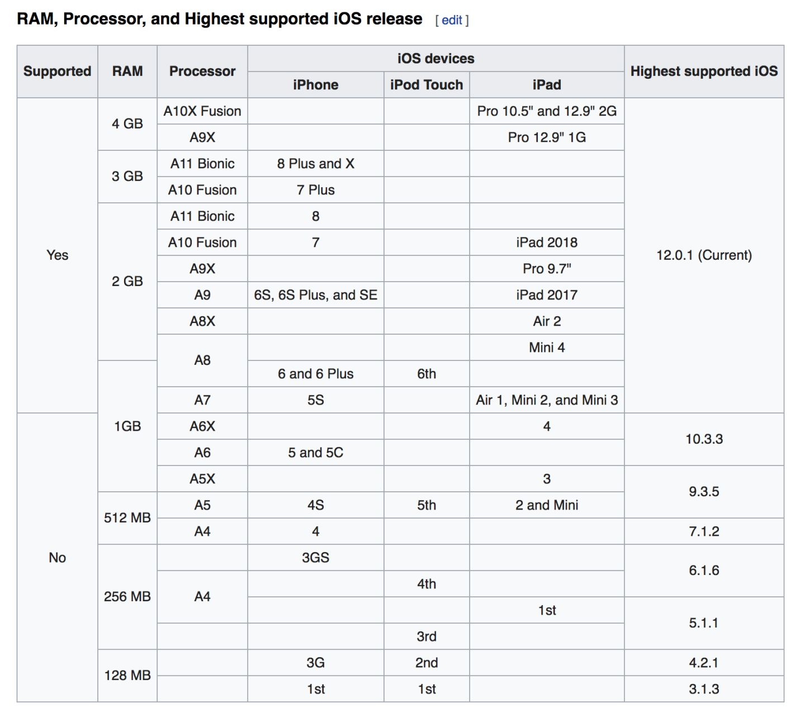
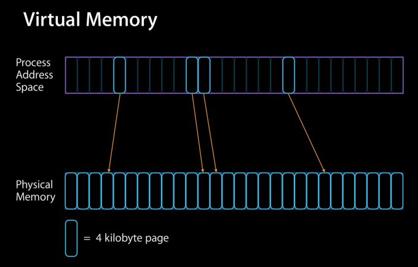
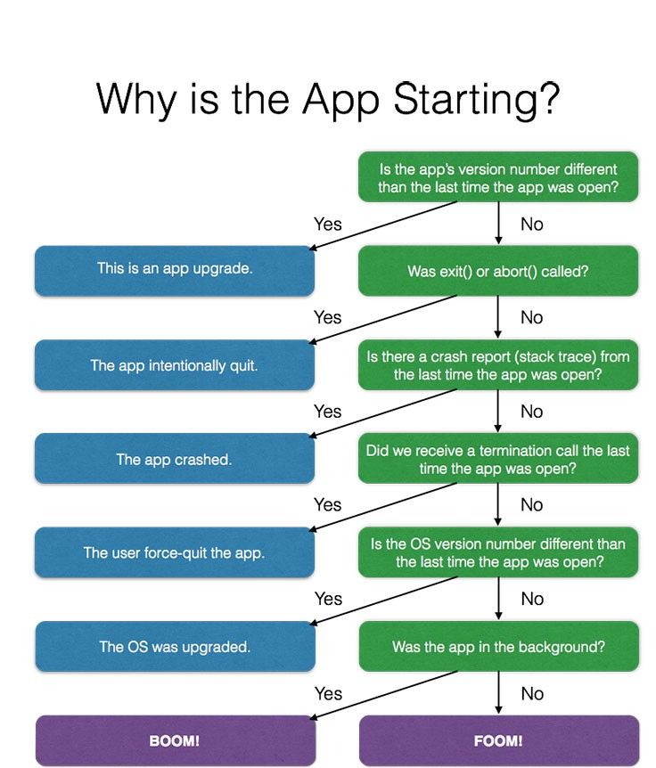
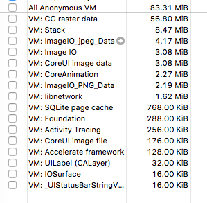
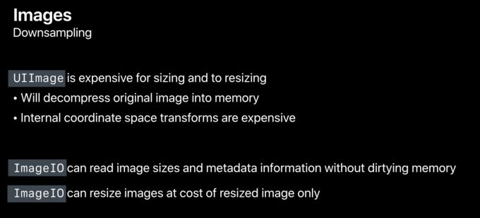
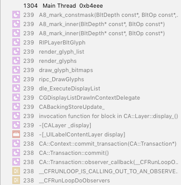
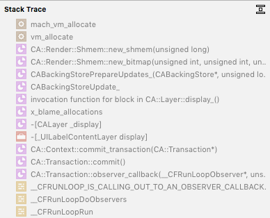
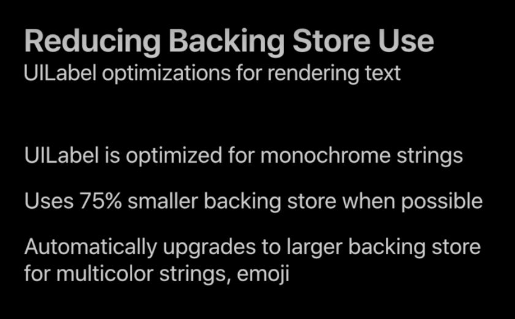

# iOS 内存管理研究

iPhone 作为一个移动设备，其计算和内存资源通常是非常有限的，而许多用户对应用的性能却很敏感，卡顿、应用回到前台丢失状态、甚至 OOM（out of memory） 闪退，这就给了 iOS 工程师一个很大的挑战。

网上的绝大多数关于 iOS 内存管理的文章，大多是围绕 ARC/MRC、循环引用的原理或者是如何找寻内存泄漏来展开的，而这些内容更准确的说应该是 ObjC 或者 Swift 的内存管理，是语言层面带来的特性，而不是操作系统本身的内存管理。

如果我们需要聊聊”管理“内存，那么就需要先了解一些基础知识。

## **内存基础概念复习**

## 物理内存

一个设备的 RAM(Random Access Memory) 大小。以下是维基百科上的资料：



简单来说，iPhone 8（不包括 plus） 和 iPhone 7（不包括 plus）及之前都是 2G 内存，iPhone 6 和 6 plus 及之前都是 1G 内存。

## 虚拟内存(VM for Virtual Memory)

每个进程都有一个自己私有的虚拟内存空间。对于32位设备来说是 4GB，而64位设备（5s以后的设备）是 18EB(1EB = 1000PB, 1PB = 1000TB)，映射到物理内存空间。

## 页

内存管理、映射中的基本单位是页，一页的大小是 4kb（早期设备）或者 16kb（A7 芯片及以后）


因为有页的存在，每次申请内存都必须以页为单位。然而这样一来，如果只是申请几个 byte，却不得不分配一页（16kb），是非常大的浪费。因此在用户态我们有 “heap” 的概念。

## Page In/Out

由于虚拟内存的空间远远大于物理内存，在任意一个时间点，虚拟内存中的一个页并不一定总是在物理内存中，而是可能被暂时存到了磁盘上，这样物理内存便可以暂时释放这部分空间，供优先级更高的任务使用，因此磁盘可以作为 backing store 以扩展物理内存（MacOS 中有，iOS 没有）。另一种可能是加载一个比较大的文件/动态库，每次使用我们可能只需要加载其中的一部分，那么就可以使用 mmap 映射这个文件到虚拟内存空间，这样当我们访问其中一部分时，系统会自动把这一部分从磁盘加载到内存，而不加载其余部分。

这样把磁盘中的数据写到内存/从内存中写回磁盘成为 page in/out。

## Wired memory

无法被 page out 的内存，主要为系统层所用，开发者不需要考虑这些。

## VM Region

一个 VM Region 是指一段连续的内存页（在虚拟地址空间里），这些页拥有相同的属性（如读写权限、是否是 wired，也就是是否能被 page out）。举几个例子：

* mapped file，即映射到磁盘的一个文件
* __TEXT，r-x，多数为二进制
* __DATA，rw-，为可读写数据
* MALLOC_(SIZE)，顾名思义是 malloc 申请的内存

## VM Object

每个 VM Region 对应一个数据结构，名为 VM Object。Object 会记录这个 Region 内存的属性

## Resident Page

当前正在物理内存中的页（没有被交换出去）

## **与其他App共存的情况**

* app 内存消耗较低，同时其他 app 也非常“自律”，不会大手大脚地消耗内存，那么即使切换到其他应用，我们自己的 app 依然是“活着”的，保留了用户的使用状态，体验较好
* app 内存消耗较低，但是其他 app 非常消耗内存（可能是使用不当，也可能是本身就非常消耗内存，比如大型游戏），那除了当前在前台的进程，其他 app 都会被系统回收，用来给活跃进程提供内存资源。这种情况我们无法控制
* app 内存消耗比较大，那切换到其他 app 以后，即使其他 app 向系统申请不是特别大的内存，系统也会因为资源紧张，优先把消耗内存较多的 app 回收掉。用户会发现只要 app 一旦退到后台，过会再打开时就会重新加载
* app 内存消耗特别大，在前台运行时就有可能被系统 kill 掉，引起闪退

在 iOS 上管理杀进程释放资源策略模块叫做 Jetsam，这里推荐 [五子棋的文章](https://link.zhihu.com/?target=https%3A//satanwoo.github.io/2017/10/18/abort/) ，其中有详细的介绍。

## **OOM的判定**

苹果官方关于 OOM 的文档和接口非常少，以至于 facebook 在判断应用是否上次因为 OOM 而闪退时，需要经过一个漫长的逻辑判断，当不满足所有条件时才能判定为 OOM（想象一下如果系统能提供一个接口，告诉开发者上次的退出原因，会方便多少！）


我们会好奇，当一个普通 app 启动时，内存消耗究竟有多少？

## **如何查看内存占用量**

我们刚讨论到内存的不同类别，那么应该选用哪个值作为内存占用量的标准呢？

## Memory Footprint

在 WWDC13 704 中，苹果推荐用 footprint 命令来查看一个进程的内存占用。

关于什么是 footprint，在官方文档 [Minimizing your app’s Memory Footprint](https://link.zhihu.com/?target=https%3A//developer.apple.com/library/archive/technotes/tn2434/_index.html) 里有说明:

```
Refers to the total current amount of system memory that is allocated to your app.
```

由于该命令只能在 MacOS 上运行，并且 iOS 上也没有 Activity Monitor，我们新建一个 Mac app，然后用不同手段测量内存占用

* Instruments 中的 All Heap & Anonymous VM: 8.32MB
* Xcode: 47.4MB
* 系统 Activity Monitor: 47.4MB
* 使用 footprint 命令（可以通过 man footprint 查看文档）: 47MB
* task_vm_info.phys_footprint: 47.4MB
* task_info.resident_size: 80MB

可以看到，Xcode、系统、footprint 工具和 phys_footprint 得到的数据是一致的，而既然官方推荐了 footprint，因此我们以这几个方法得到的结果作为标准。猜测 footprint 比 Instruments 数据更大的原因是存在一些”非代码执行开销“，如把系统和应用二进制加载进内存。iOS 中虽然不能使用系统 Activity Monitor 和 footprint 命令，也能在 Xcode 中和 phys_footprint 得到同样的结果。

至此我们可以得到一个结论: Instruments 中显示的部分，其实也只是整个应用进程里内存的一部分。但是由于我们能够控制的只有这一部分，因此应该把精力投入到 Instruments 的分析中去。

## **使用 Instruments 分析**

应用的详细性能分析总是需要依赖 Instruments 的强大功能。从 Allocations 角度来看，总的内存占用 = All Heap Allocations + All Anonymous VM：


* All Heap Allocations，几乎所有类实例，包括 UIViewController、UIView、UIImage、Foundation 和我们代码里的各种类/结构实例。一般和我们的代码直接相关。
* All Anonymous VM，可以看到都是由”VM:”开头的


主要包含一些系统模块的内存占用。有些部分虽然看起来离我们的业务逻辑比较远，但其实是保证我们代码正常运行不可或缺的部分，也是我们常常忽视的部分。一般包括：

* CG raster data（光栅化数据，也就是像素数据。注意不一定是图片，一块显示缓存里也可能是文字或者其他内容。通常每像素消耗 4 个字节）
* Image IO（图片编解码缓存）
* Stack(每个线程都会需要500KB左右的栈空间)
* CoreAnimation
* SQLite
* network
* 等等

我们平时最经常会做的 debug 之一，就是查找循环引用。而循环引用造成的 leak 数据通常是 UIKit 或我们自己的一些数据结构，会被归类到 heap。这些是我们相对熟悉的，网上也有非常多的文章，这里不再讨论。而就 VM 这块来说，因为不受我们直接控制，文档也较少，所以相对神秘一些，往往容易被忽视。

对于 VM 中的线程栈开销、网络 buffer 等，我们其实没有太大的控制能力，通常这些也不会是内存开销的主要原因（除非有成百上千的线程和频繁大量的网络请求）。而对于即刻和绝大多数 app 来说，尤其是采用了 AsyncDisplayKit（用空间换时间）的情况下，渲染开销是绝对不可忽视的一块。

我一直认为，移动设备上不管是 CPU、GPU 还是内存，最大的性能杀手一定是布局和渲染。布局数据和一般数据结构类似，单个内存开销最多以 KB 计，而渲染缓存很容易就用“兆”来计算，更容易影响到整体开销。

任意打开一个 app，可以看到渲染无非就是两大部分：图片和文字。

## **图片渲染开销**

我们知道，解压后的图片是由无数像素数据组成。每个像素点通常包括红、绿、蓝和 alpha 数据，每个值都是 8 位（0–255），因此一个像素通常会占用 4 个字节（32 bit per pixel。少数专业的 app 可能会用更大的空间来表示色深，消耗的内存会相应线性增加）。

下面我们来计算一些通常的图片开销：

* 普通图片大小，如 500 * 600 * 32bpp = 1MB
* 跟 iPhone X 屏幕一样大的：1125 * 2436 * 32bpp = 10MB
* 即刻中允许最大的图片，总像素不超过1500w：15000000 * 32bpp = 57MB

有了大致的概念，以后看到一张图能简单预估，大概会吃掉多少内存。

## 缩放

* 内存开销多少与图片文件的大小（解压前的大小）没有直接关系，而是跟图片分辨率有关。举个例子：同样是 100 * 100，jpeg 和 png 两张图，文件大小可能差几倍，但是渲染后的内存开销是完全一样的——解压后的图片 buffer 大小与图片尺寸成正比，有多少像素就有多少数据。

* 通常我们下载的图片和最终展示在界面上的尺寸是不同的，有时可能需要将一张巨型图片展示在一个很小的 view 里。如果不做缩放，那么原图就会被整个解压，消耗大量内存，而很多像素点会在展示前被压缩掉，完全浪费了。所以把图片缩放到实际显示大小非常重要，而且解码量变少的话，速度也会提高很多。

* 如果在网上搜索图片缩放方案的话，一般都会找到类似“新建一个 context ，把图画在里面，再从 context 里读取图片”的答案。此时如果原图很大，那么即使缩放后的图片很小，解压原图的过程仍然需要占用大量内存资源，一不小心就会 OOM。但是如果换用 ImageIO 情况就会好很多，整个过程最多只会占用缩放后的图片所需的内存（通常只有原图的几分之一），大大减少了内存压力。


## 解码

图片解码是每个开发者都绕不过去的话题。图片从压缩的格式化数据变成像素数据需要经过解码，而解码对 CPU 和内存的开销都比较大，同时解码后的数据如何管理，如何显示都是需要我们注意的。

* 通常我们把一张图片设置到 UIImageView 上，系统会自动处理解码过程，但这样会在主线程上占用一定 CPU 资源，引起卡顿。使用 ImageIO 解码 + 后台线程执行是 WWDC(18 session 219) 推荐的做法。
* ImageIO 功能很强大，但是不支持 webp
* AsyncDisplayKit 的一大思想是拿空间换时间，换取流畅的性能，但是内存开销会比 UIKit 高。同样用一个全屏的 UIImageView 测试，直接用UIImage(named:)来设置图片，虽然不可避免要在主线程上做解压，但是消耗的内存反而较小，只有4MB（正常需要10MB）。猜测神秘的 IOSurface 对图片数据做了某些优化。苹果有这么一段话描述 IOSurface：

```
Share hardware-accelerated buffer data (framebuffers and textures) across multiple processes. Manage image memory more efficiently.
```

## 渲染

网上关于渲染的资料很多，但是很多都是人云亦云，我们来说一些比较少讨论的点：

* 我们经常会需要预先渲染文字/图片以提高性能，此时需要尽可能保证这块 context 的大小与屏幕上的实际尺寸一致，避免浪费内存。可以通过 View Hierarchy 调试工具，打印一个 layer 的 contents 属性来查看其中的 CGImage（backing image）以及其大小


作为 backing image 的 CGImage

* 一旦涉及到 offscreen rendering，就可能会需要多消耗一块内存/显存。那到底什么是离屏渲染？不管是 CPU 还是 GPU，只要不能直接在 frame buffer 上画，都属于offscreen rendering。在 Core Animation: Advanced Techniques 书里有 offscreen rendering 的一段说明：

```
Offscreen rendering is invoked whenever the combination of layer properties that have been specified mean that the layer cannot be drawn directly to the screen without pre- compositing. Offscreen rendering does not necessarily imply software drawing, but it means that the layer must first be rendered (either by the CPU or GPU) into an offscreen context before being displayed.
```

* layer mask 会造成离屏渲染，猜想可能是由于涉及到”根据 mask 去掉一些像素“，无法直接在 frame buffer 中做
* 圆角要慎用，但不是说完全不能用— — 只有圆角和 clipsToBounds 结合的时候，才会造成离屏渲染。猜想这两者结合起来也会造成类似 mask 的效果，用来切除圆角以外的部分
* backgroundColor 可以直接在 frame buffer 上画，因此并不需要额外内存

## **文字渲染的CPU和内存开销**

关于文字渲染的文档资料并不是很多，因此我们需要做一些实验来判断。 新建一个项目，添加一个全屏的 label，不停切换文字，得到 cpu 占用率稳定在 15%，gpu占用率 0%。并且 Time Profiling 显示


排名第一的方法主要是在调用 render_glyphs，说明主要是 CPU 参与了文字渲染。


- 文字渲染中，主要内存开销调用栈：
  


* 虽然文字比较多，但是只占用了 2.75MB（2883584 byte，可以看到这边苹果仍然是用1024KB = 1MB的换算）的内存。那么问题来了，我们上面提到一块跟屏幕一样大的显示区域占用空间大约是 10MB，为什么文字占用这么少呢？


理论上 iPhone X 全屏有 1125 * 2436 = 2740500 个像素，距离实际占用内存非常接近，只多了 143084 byte（139.73kb），说明差不多正好是一个像素对应一个字节。这印证了 WWDC（WWDC18 219和416）上的结论，即黑白的位图只占用 1 个字节，比 4 字节节省 75% 的空间。当然实际使用过程中很难限制文字只采用黑白两种颜色，但是还是应该了解苹果的优化过程。



在以上测试基础上，如果我们尝试把第一个字符加上红色属性，或者添加 emoji，那么渲染结果就不再是黑白的了，而是一张彩色图片，类似普通图片那样每个像素需要 4 个字节来描述。因此理论上所消耗的内存会变成 2.75MB * 4 = 10MB 多一点。测试得到：


结果占用了 11468800 bytes，是原来 2740500 的 3.97 倍，与理论值 4 非常接近（可能内存中还存在一些附属的其他元数据，而这些不会如同像素数据一样线性放大，因此不完全是精确 4 倍关系）。比较好的印证了之前的结论。

整整一屏的文字，在 3x 设备上，只占用了 2MB 多一点的内存，可以说是非常省了。

## **总结**

iOS 的内存管理有以下几个特点：

* 文档较少，系统提供的接口也较少，因此大家自己生产的轮子较多，需要多做实验才能得到可靠的结论。多利用 Instruments 也会发现一些之前忽略的点
* 内存问题的暴露有一定延时性，OOM 在本地很难复现，需要投入大量时间测试，同时配套相应的监控系统
* 技术变化较慢，操作系统这一层的知识在过去和未来的很长一段时间都不太会改变，或只是微调，值得花时间来研究
* 经典的时空取舍问题，在资源有限的设备上，如何平衡 CPU/GPU 和内存的开销，来达到性能最大化
* 能够帮助我们了解一些文字和图片渲染的本质，更好的了渲染系统的工作原理，毕竟这是客户端工程师不可替代的职责之一

## **推荐阅读**

[Core Animation: Advanced Techniques](https://link.zhihu.com/?target=https%3A//www.oreilly.com/library/view/ios-core-animation/9780133440744/) 

[MacOS and *OS Internals](https://link.zhihu.com/?target=http%3A//newosxbook.com/index.php) 

[About the Virtual Memory System](https://link.zhihu.com/?target=https%3A//developer.apple.com/library/archive/documentation/Performance/Conceptual/ManagingMemory/Articles/AboutMemory.html) 

[Minimizing your app’s Memory Footprint](https://link.zhihu.com/?target=https%3A//developer.apple.com/library/archive/technotes/tn2434/_index.html) 

WWDC 13 704: Building Efficient OS X Apps

WWDC 18 219: Images and Graphics Best Practices

WWDC 18 416: iOS Memory Deep Dive


[iOS 内存管理研究](https://zhuanlan.zhihu.com/p/49829766)